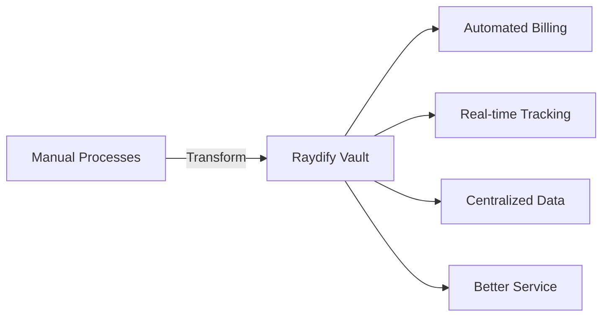

<div align="center">

# 🧭 Raydify Vault

### *Smart Inventory & Rental Management Web Application*

[](https://vault.raydify.in)
[](https://vault.raydify.in)
[](LICENSE)


**[🌐 Live Demo](https://vault.raydify.in)** • **[📖 Documentation](#)** • **[🐛 Report Bug](#-bug--feature-request)** • **[✨ Request Feature](#-bug--feature-request)**

---

### *Empowering businesses with seamless asset tracking, customer management, and automated billing*


</div>

---

## 📑 Table of Contents

- [🎥 Demo](#-demo)
- [📊 Overview](#-overview)
- [💡 Motivation](#-motivation)
- [⚙️ Technical Aspect](#️-technical-aspect)
- [🔧 Installation](#-installation)
- [🚀 Run](#-run)
- [☁️ Deployment on Render](#️-deployment-on-render)
- [📁 Directory Tree](#-directory-tree)
- [✅ To Do](#-to-do)
- [🐛 Bug / Feature Request](#-bug--feature-request)
- [💻 Technologies Used](#-technologies-used)
- [👥 Team](#-team)
- [📄 License](#-license)
- [🙏 Credits](#-credits)

---

## 🎥 Demo

<div align="center">

### Experience Raydify Vault in Action

**🔗 [vault.raydify.in](https://vault.raydify.in)**


> *Click above to watch the full walkthrough video*

</div>

### 📸 Screenshots

<details>
<summary>🖼️ Click to expand screenshots</summary>

<div align="center">

#### Dashboard Overview


#### Inventory Management


#### Customer Management


#### Billing & Invoices


#### Call Management


</div>

</details>

---

## 📊 Overview

**Raydify Vault** is a comprehensive web application designed to revolutionize inventory and rental management for businesses handling IT assets. Built with modern technologies, it provides an all-in-one solution for tracking assets, managing customers, automating billing, and handling service requests.

<div align="center">

| Feature | Description |
|---------|-------------|
| 🧾 **Inventory Management** | Real-time stock tracking with QR code support |
| 👥 **Customer Management** | Multi-step customer onboarding with rental assignments |
| 💳 **Automated Billing** | Generate professional PDF invoices with recurring billing |
| 🛠️ **Service Management** | Complete call logging and resolution tracking |
| 🔁 **Trade Module** | Purchase/sale management with automatic inventory updates |
| 🔒 **Multi-User System** | Isolated client dashboards with complete data segregation |

</div>

### 🎯 Key Highlights

```
✨ Real-time inventory tracking with 600+ assets
📊 Automated monthly billing for recurring rentals
🎫 QR code-based asset identification
📱 Responsive design for all devices
🔐 Secure multi-tenant architecture
📈 Comprehensive analytics dashboard
```

---

## 💡 Motivation

The rental and inventory management industry faces several challenges:

- 📝 **Manual tracking** leads to errors and inefficiencies
- 💰 **Billing complexity** for multiple customers and varied rental periods
- 📞 **Service request management** scattered across multiple platforms
- 🔍 **Asset visibility** lacking in traditional systems
- 👥 **Customer data** not centralized

### Our Solution

Raydify Vault was born from real-world experience working with **GAC Infotech**, managing 600+ rental computers. We identified pain points and built a solution that:

- ✅ Centralizes all operations in one dashboard
- ✅ Automates repetitive tasks like billing
- ✅ Provides real-time visibility into inventory
- ✅ Simplifies customer and service management
- ✅ Scales effortlessly with business growth

<div align="center">



</div>

---

## ⚙️ Technical Aspect

### 🏗️ Architecture

Raydify Vault follows a modern **MVC architecture** with clear separation of concerns:

```
┌─────────────────────────────────────────────────────┐
│                    Client Layer                      │
│  React.js + Tailwind CSS + Context API              │
└────────────────┬────────────────────────────────────┘
                 │ HTTPS/REST
┌────────────────▼────────────────────────────────────┐
│                   Server Layer                       │
│  Node.js + Express.js + JWT Authentication          │
└────────────────┬────────────────────────────────────┘
                 │ Mongoose ODM
┌────────────────▼────────────────────────────────────┐
│                  Database Layer                      │
│  MongoDB Atlas (Cloud Database)                      │
└─────────────────────────────────────────────────────┘
```

### 🔐 Security Features

- **JWT Authentication** - Secure token-based authentication
- **Password Hashing** - Bcrypt encryption for user passwords
- **Data Isolation** - Complete segregation between client accounts
- **Role-Based Access** - Admin and client-level permissions
- **Input Validation** - Server-side validation for all inputs

### 🎨 Frontend Architecture


```javascript
// Component Structure
src/
├── components/
│   ├── Dashboard/
│   ├── Inventory/
│   ├── Customers/
│   ├── Billing/
│   └── Calls/
├── context/
│   └── AuthContext.js
├── services/
│   └── api.js
└── utils/
    └── helpers.js
```

### 🔌 Backend Architecture


```javascript
// API Structure
routes/
├── auth.js       // Authentication endpoints
├── inventory.js  // Inventory CRUD operations
├── customers.js  // Customer management
├── billing.js    // Invoice generation
├── calls.js      // Service call tracking
└── trade.js      // Purchase/sale operations
```

### 📊 Database Schema

<details>
<summary>🗄️ Click to view database schema</summary>

```javascript
// User Schema
{
  name: String,
  email: String,
  password: String (hashed),
  role: ['admin', 'client'],
  clientId: ObjectId,
  createdAt: Date
}

// Inventory Schema
{
  itemName: String,
  serialNumber: String,
  qrCode: String,
  category: String,
  status: ['available', 'rented'],
  assignedTo: ObjectId (Customer),
  clientId: ObjectId,
  createdAt: Date
}

// Customer Schema
{
  name: String,
  contact: String,
  email: String,
  address: String,
  rentedItems: [ObjectId],
  totalRent: Number,
  paidAmount: Number,
  pendingAmount: Number,
  clientId: ObjectId,
  createdAt: Date
}

// Billing Schema
{
  customerId: ObjectId,
  invoiceNumber: String,
  items: [{ item, rent, quantity }],
  totalAmount: Number,
  dueDate: Date,
  status: ['paid', 'pending'],
  pdfUrl: String,
  clientId: ObjectId,
  generatedAt: Date
}
```

</details>

---

## 🔧 Installation

### Prerequisites

Before you begin, ensure you have the following installed:

```bash
node -v   # v14.0.0 or higher
npm -v    # v6.0.0 or higher
git --version
```

### 📥 Clone the Repository

```bash
git clone https://github.com/yourusername/raydify-vault.git
cd raydify-vault
```

### 📦 Install Dependencies

#### Backend Setup

```bash
cd backend
npm install
```

#### Frontend Setup

```bash
cd ../frontend
npm install
```

### 🔑 Environment Variables

Create `.env` files in both frontend and backend directories:

**Backend `.env`**

```env
PORT=5000
MONGODB_URI=your_mongodb_connection_string
JWT_SECRET=your_super_secret_jwt_key
NODE_ENV=development
CORS_ORIGIN=http://localhost:3000
```

**Frontend `.env`**

```env
REACT_APP_API_URL=http://localhost:5000/api
REACT_APP_ENV=development
```

---

## 🚀 Run

### Development Mode

Open two terminal windows:

**Terminal 1 - Backend Server**

```bash
cd backend
npm run dev
```

Server runs on `http://localhost:5000`

**Terminal 2 - Frontend Server**

```bash
cd frontend
npm start
```

Application opens at `http://localhost:3000`

### Production Build

```bash
# Build frontend
cd frontend
npm run build

# Start backend in production mode
cd ../backend
npm start
```

---

## ☁️ Deployment on Render

### 🎯 Step-by-Step Deployment Guide


#### 1️⃣ Prepare Your Repository

```bash
# Ensure all code is committed
git add .
git commit -m "Ready for deployment"
git push origin main
```

#### 2️⃣ Deploy Backend

1. Go to [Render Dashboard](https://render.com)
2. Click **New +** → **Web Service**
3. Connect your GitHub repository
4. Configure:
   - **Name**: `raydify-vault-backend`
   - **Environment**: `Node`
   - **Build Command**: `npm install`
   - **Start Command**: `npm start`
   - **Plan**: Free

5. Add Environment Variables:
   ```
   MONGODB_URI=your_mongodb_atlas_uri
   JWT_SECRET=your_secret_key
   NODE_ENV=production
   ```

#### 3️⃣ Deploy Frontend

1. Click **New +** → **Static Site**
2. Connect repository
3. Configure:
   - **Name**: `raydify-vault-frontend`
   - **Build Command**: `cd frontend && npm install && npm run build`
   - **Publish Directory**: `frontend/build`

4. Add Environment Variables:
   ```
   REACT_APP_API_URL=https://raydify-vault-backend.onrender.com/api
   ```

#### 4️⃣ Custom Domain Setup

1. Go to **Settings** → **Custom Domain**
2. Add: `vault.raydify.in`
3. Update DNS records as instructed
4. Wait for SSL certificate provisioning

### 🔄 Auto-Deployment

Render automatically deploys on every push to `main` branch.

---

## 📁 Directory Tree

```
raydify-vault/
│
├── frontend/
│   ├── public/
│   │   ├── index.html
│   │   └── favicon.ico
│   ├── src/
│   │   ├── components/
│   │   │   ├── Dashboard/
│   │   │   │   ├── Dashboard.jsx
│   │   │   │   └── Dashboard.css
│   │   │   ├── Inventory/
│   │   │   │   ├── InventoryList.jsx
│   │   │   │   ├── AddInventory.jsx
│   │   │   │   └── QRScanner.jsx
│   │   │   ├── Customers/
│   │   │   │   ├── CustomerList.jsx
│   │   │   │   ├── AddCustomer.jsx
│   │   │   │   └── CustomerDetails.jsx
│   │   │   ├── Billing/
│   │   │   │   ├── BillingDashboard.jsx
│   │   │   │   ├── GenerateInvoice.jsx
│   │   │   │   └── InvoiceTemplate.jsx
│   │   │   ├── Calls/
│   │   │   │   ├── CallsList.jsx
│   │   │   │   └── AddCall.jsx
│   │   │   ├── Trade/
│   │   │   │   ├── Purchase.jsx
│   │   │   │   └── Sale.jsx
│   │   │   └── Auth/
│   │   │       ├── Login.jsx
│   │   │       └── Register.jsx
│   │   ├── context/
│   │   │   └── AuthContext.js
│   │   ├── services/
│   │   │   └── api.js
│   │   ├── utils/
│   │   │   ├── helpers.js
│   │   │   └── constants.js
│   │   ├── App.js
│   │   ├── index.js
│   │   └── index.css
│   ├── package.json
│   └── tailwind.config.js
│
├── backend/
│   ├── config/
│   │   └── db.js
│   ├── models/
│   │   ├── User.js
│   │   ├── Inventory.js
│   │   ├── Customer.js
│   │   ├── Billing.js
│   │   ├── Call.js
│   │   └── Trade.js
│   ├── routes/
│   │   ├── auth.js
│   │   ├── inventory.js
│   │   ├── customers.js
│   │   ├── billing.js
│   │   ├── calls.js
│   │   └── trade.js
│   ├── middleware/
│   │   ├── auth.js
│   │   └── validation.js
│   ├── controllers/
│   │   ├── authController.js
│   │   ├── inventoryController.js
│   │   ├── customerController.js
│   │   ├── billingController.js
│   │   ├── callController.js
│   │   └── tradeController.js
│   ├── utils/
│   │   ├── pdfGenerator.js
│   │   └── qrCodeGenerator.js
│   ├── server.js
│   └── package.json
│
├── assets/
│   ├── logo.png
│   ├── dashboard-preview.png
│   └── screenshots/
│
├── .gitignore
├── README.md
└── LICENSE
```

---

## ✅ To Do

### 🚀 Upcoming Features

- [ ] **Mobile Application** - React Native app for on-the-go management
- [ ] **WhatsApp Integration** - Automated billing reminders via WhatsApp
- [ ] **Advanced Analytics** - Revenue forecasting and trend analysis
- [ ] **Barcode Scanner** - Mobile barcode scanning for inventory
- [ ] **Email Notifications** - Automated invoice and reminder emails
- [ ] **Payment Gateway** - Integrate online payment options
- [ ] **Export Reports** - Excel/CSV export for all data
- [ ] **Multi-language Support** - Hindi and regional language support
- [ ] **Dark Mode** - Theme customization options
- [ ] **API Documentation** - Swagger/OpenAPI documentation
- [ ] **Inventory Alerts** - Low stock and maintenance reminders
- [ ] **Customer Portal** - Self-service portal for customers

### 🔧 Improvements

- [ ] Add unit and integration tests
- [ ] Implement caching with Redis
- [ ] Optimize database queries
- [ ] Add image upload for inventory items
- [ ] Implement advanced search and filters
- [ ] Add audit logs for all operations

---

## 🐛 Bug / Feature Request

We welcome contributions! If you find a bug or want to request a feature:

### 🐞 Report a Bug

1. Go to [Issues](https://github.com/yourusername/raydify-vault/issues)
2. Click **New Issue**
3. Select **Bug Report** template
4. Fill in the details:
   - Clear description of the bug
   - Steps to reproduce
   - Expected vs actual behavior
   - Screenshots (if applicable)
   - Environment details

### ✨ Request a Feature

1. Go to [Issues](https://github.com/yourusername/raydify-vault/issues)
2. Click **New Issue**
3. Select **Feature Request** template
4. Describe:
   - The feature you'd like
   - Why it would be useful
   - How it should work
   - Any examples or mockups

### 💬 Join the Discussion

Join our community discussions for:
- General questions
- Best practices
- Feature ideas
- Implementation help

---

## 💻 Technologies Used

<div align="center">

### Frontend

[](https://reactjs.org/)
[](https://tailwindcss.com/)
[](https://reactjs.org/docs/context.html)

### Backend

[](https://nodejs.org/)
[](https://expressjs.com/)
[](https://www.mongodb.com/)
[](https://mongoosejs.com/)

### Authentication & Security

[](https://jwt.io/)
[](https://www.npmjs.com/package/bcrypt)

### Deployment & Tools

[](https://render.com/)
[](https://git-scm.com/)
[](https://github.com/)

</div>

### 📚 Complete Tech Stack

| Layer | Technology | Purpose |
|-------|-----------|---------|
| **Frontend** | React.js | UI components and state management |
| | Tailwind CSS | Responsive styling framework |
| | Axios | HTTP client for API requests |
| | React Router | Client-side routing |
| | QR Code Generator | Generate QR codes for assets |
| **Backend** | Node.js | Server runtime environment |
| | Express.js | Web application framework |
| | JWT | Token-based authentication |
| | Bcrypt | Password hashing |
| | Validator | Input validation |
| **Database** | MongoDB Atlas | Cloud database service |
| | Mongoose | MongoDB object modeling |
| **DevOps** | Render | Cloud hosting platform |
| | Git/GitHub | Version control |
| **Additional** | PDF-Lib | Invoice PDF generation |
| | Nodemailer | Email functionality (planned) |

---

## 👥 Team

<div align="center">

### Meet the Developers

<table>
  <tr>
    <td align="center">
      <a href="https://github.com/yourusername">
        
        <br />
        <sub><b>Your Name</b></sub>
      </a>
      <br />
      <sub>Full Stack Developer</sub>
      <br />
      <a href="https://linkedin.com/in/yourprofile">LinkedIn</a> •
      <a href="https://github.com/yourusername">GitHub</a>
    </td>
    <td align="center">
      <a href="https://github.com/teammember2">
        
        <br />
        <sub><b>Team Member 2</b></sub>
      </a>
      <br />
      <sub>Backend Developer</sub>
      <br />
      <a href="https://linkedin.com/in/member2">LinkedIn</a> •
      <a href="https://github.com/teammember2">GitHub</a>
    </td>
    <td align="center">
      <a href="https://github.com/teammember3">
        
        <br />
        <sub><b>Team Member 3</b></sub>
      </a>
      <br />
      <sub>Frontend Developer</sub>
      <br />
      <a href="https://linkedin.com/in/member3">LinkedIn</a> •
      <a href="https://github.com/teammember3">GitHub</a>
    </td>
  </tr>
</table>

### 🤝 Contributors

We appreciate all contributions! Check out our [Contributors Graph](https://github.com/yourusername/raydify-vault/graphs/contributors).

</div>

---

## 📄 License

This project is licensed under the **MIT License** - see the [LICENSE](LICENSE) file for details.

```
MIT License

Copyright (c) 2025 Raydify

Permission is hereby granted, free of charge, to any person obtaining a copy
of this software and associated documentation files (the "Software"), to deal
in the Software without restriction, including without limitation the rights
to use, copy, modify, merge, publish, distribute, sublicense, and/or sell
copies of the Software, and to permit persons to whom the Software is
furnished to do so, subject to the following conditions...
```

---

## 🙏 Credits

### 🌟 Special Thanks

- **GAC Infotech** - For being our first real-world implementation partner
- **Raydify Team** - For continuous support and guidance
- **Open Source Community** - For amazing tools and libraries

### 📚 Resources & Inspiration

- [React Documentation](https://reactjs.org/docs)
- [MongoDB University](https://university.mongodb.com/)
- [Tailwind CSS](https://tailwindcss.com/docs)
- [Node.js Best Practices](https://github.com/goldbergyoni/nodebestpractices)

### 🛠️ Built With

This project wouldn't be possible without these amazing open-source projects:

- [React](https://reactjs.org/) - UI Framework
- [Express.js](https://expressjs.com/) - Backend Framework
- [MongoDB](https://www.mongodb.com/) - Database
- [Tailwind CSS](https://tailwindcss.com/) - CSS Framework
- [JWT](https://jwt.io/) - Authentication
- [Render](https://render.com/) - Hosting Platform

---

<div align="center">

## 🌟 Show Your Support

If you found this project helpful, please consider giving it a ⭐️!

[](https://github.com/yourusername/raydify-vault/stargazers)
[](https://github.com/yourusername/raydify-vault/network/members)

### 📬 Contact Us

[](mailto:contact@raydify.in)
[](https://raydify.in)
[](https://linkedin.com/company/raydify)

---

<sub>Built with ❤️ by the Raydify Team</sub>


</div>
